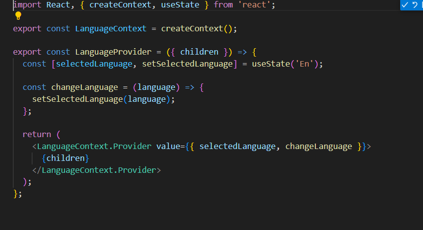
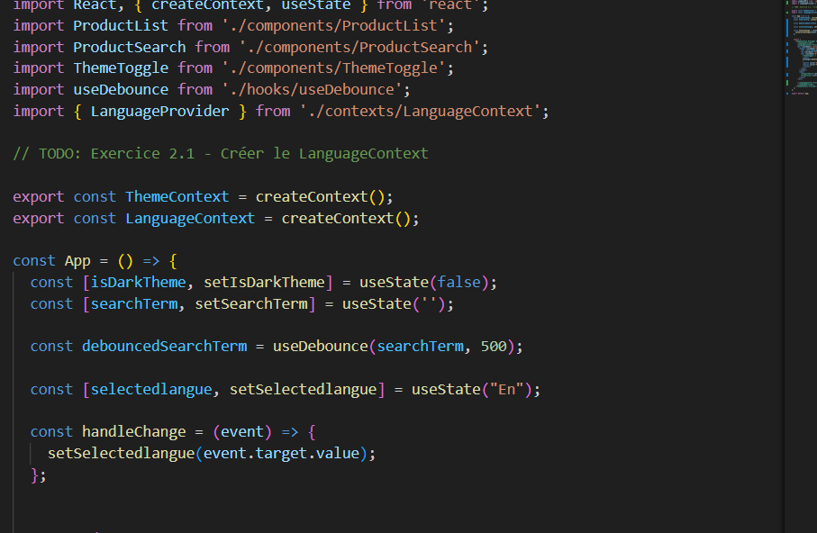
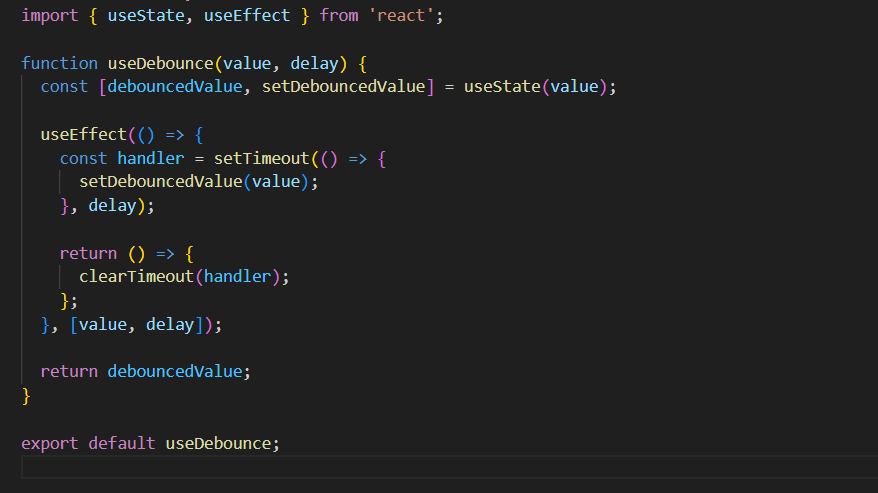
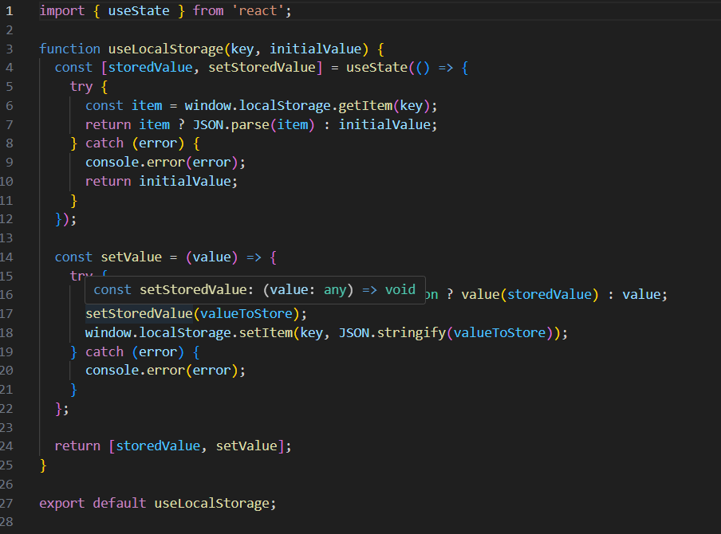

# TP React Hooks - Application de Gestion de Produits

Ce TP a pour objectif de mettre en pratique l'utilisation des Hooks React (useState, useEffect, useContext) ainsi que la création de Hooks personnalisés.

## Installation et configuration initiale

1. Cloner le dépôt :
```bash
git clone https://github.com/pr-daaif/tp-react-hooks.git
cd tp-react-hooks
```

2. Créer votre propre dépôt sur Github et changer le remote :
```bash
# Supprimer le remote origine
git remote remove origin

# Ajouter votre nouveau remote
git remote add origin https://github.com/[votre-username]/tp-react-hooks.git

# Premier push
git push -u origin main
```

3. Installer les dépendances :
```bash
npm install
```

4. Lancer l'application :
```bash
npm start
```

## Instructions pour le TP

Pour chaque exercice :
1. Lisez attentivement l'énoncé
2. Implémentez la solution
3. Testez votre implémentation (pensez à faire des copies d'écran)
4. Mettez à jour la section correspondante dans ce README avec :
   - Une brève explication de votre solution
   - Des captures d'écran montrant le fonctionnement
   - Les difficultés rencontrées et comment vous les avez résolues
5. Commitez vos changements avec un message descriptif

### Exercice 1 : État et Effets 
#### Objectif : Implémenter une recherche en temps réel

- [x] 1.1 Modifier le composant ProductSearch pour utiliser la recherche
- [x] 1.2 Implémenter le debounce sur la recherche
- [ ] 1.3 Documenter votre solution ici

_Votre réponse pour l'exercice 1 :_
```
Pour l'exercice 1.1, nous avons modifié le composant `ProductSearch` pour qu'il utilise l'état local et les effets afin de gérer la recherche en temps réel. Nous avons ajouté un champ de saisie qui met à jour l'état de la recherche à chaque frappe de l'utilisateur.

Pour l'exercice 1.2, nous avons implémenté un hook personnalisé `useDebounce` pour retarder la mise à jour de l'état de la recherche jusqu'à ce que l'utilisateur ait cessé de taper pendant un certain délai. Cela permet de réduire le nombre de requêtes de recherche effectuées et d'améliorer les performances.

[Ajoutez vos captures d'écran]
```


### Exercice 2 : Context et Internationalisation
#### Objectif : Gérer les préférences de langue

- [x] 2.1 Créer le LanguageContext
- [x] 2.2 Ajouter le sélecteur de langue
- [ ] 2.3 Documenter votre solution ici

_Votre réponse pour l'exercice 2 :_
```
Pour l'exercice 2.1, nous avons créé un `LanguageContext` pour gérer les préférences de langue de l'utilisateur. Ce contexte fournit l'état de la langue sélectionnée et une fonction pour changer la langue.

Pour l'exercice 2.2, nous avons ajouté un composant `LanguageSelector` qui permet à l'utilisateur de sélectionner sa langue préférée. Ce composant utilise le `LanguageContext` pour mettre à jour la langue sélectionnée.

[Ajoutez vos captures d'écran]




### Exercice 3 : Hooks Personnalisés
#### Objectif : Créer des hooks réutilisables

- [x] 3.1 Créer le hook useDebounce
- [x] 3.2 Créer le hook useLocalStorage
- [ ] 3.3 Documenter votre solution ici

_Votre réponse pour l'exercice 3 :_
```
Pour l'exercice 3.1, nous avons créé un hook personnalisé `useDebounce` qui permet de retarder la mise à jour d'une valeur jusqu'à ce que l'utilisateur ait cessé de taper pendant un certain délai. Ce hook est utilisé pour améliorer les performances de la recherche en temps réel.

Pour l'exercice 3.2, nous avons créé un hook personnalisé `useLocalStorage` qui permet de gérer l'état avec le stockage local. Ce hook facilite la lecture et l'écriture dans le `localStorage` du navigateur, permettant de persister les données entre les sessions.

[Ajoutez vos captures d'écran]



### Exercice 4 : Gestion Asynchrone et Pagination
#### Objectif : Gérer le chargement et la pagination

- [x] 4.1 Ajouter le bouton de rechargement
- [x] 4.2 Implémenter la pagination
- [ ] 4.3 Documenter votre solution ici

_Votre réponse pour l'exercice 4 :_
```
Pour l'exercice 4.1, nous avons ajouté un bouton de rechargement dans le composant `ProductList` qui permet de recharger les produits en cas d'erreur ou de besoin de mise à jour.

Pour l'exercice 4.2, nous avons implémenté la pagination dans le composant `ProductList`. Cela permet de naviguer entre les pages de produits en utilisant les boutons "Précédent" et "Suivant".

[Ajoutez vos captures d'écran]


## Rendu

- Ajoutez l'URL de votre dépôt Github dans  **Classroom** et envoyer la réponse dès le démarage de votre projet.
- Les push doivent se faire au fûr et à mesure que vous avancez dans votre projet.
- Le README.md doit être à jour avec vos réponses et captures d'écran. 
- Chaques exercice doit faire l'objet d'au moins un commit avec un message mentionnant le numéro de l'exercice.